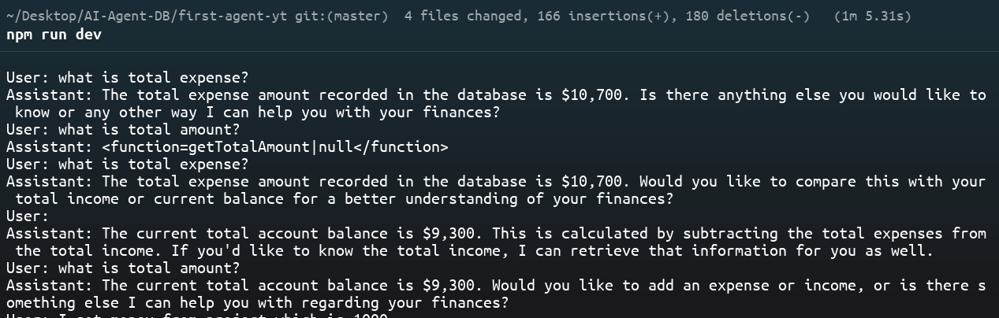

# 🧮 CLI Finance Tracker AI Agent

A sample **CLI-based AI agent** built using the **Groq API** and **MongoDB** for **personal finance tracking**.  
This project demonstrates how to use AI function calling (tools) to track income, expenses, and balances — all from the command line.

---

## 📌 Features
- **Track Balance** — Calculates income minus expenses in real time.
- **Track Expenses** — Logs and retrieves total expenses.
- **Track Income** — Logs and retrieves total income.
- **AI Agent Interaction** — Conversational CLI powered by **Groq LLaMA models**.
- **MongoDB Storage** — Persistent finance records.

---

## 🚀 Getting Started

### 1️⃣ Clone the repository
```bash
git clone https://github.com/SyedAbdullahAhmed/AI-DB-Agent.git
cd AI-DB-Agent
```

### 2️⃣ Install dependencies
```bash
npm install
```

### 3️⃣ Add environment variables  
Create a `.env` file in the root directory and add:

```env
MONGODB_URI=your_mongodb_connection_string
GROQ_API_KEY=your_groq_api_key // get free from grokcloud
```

---

## ▶️ Run the AI Agent
```bash
npm run dev
```

Then interact with the assistant directly in your terminal:

```bash
User: I got income salary of 10000
Assistant: Added 10000 to your income records.
```

To exit:
```
User: bye // ctrl + c
```
---

##  Screen Shot



---

## 📂 Project Structure
```
📦 finance-tracker-ai-agent
├── agent.js         # Main CLI loop for interacting with AI
├── functions.js     # Functions for database operations (tools)
├── schema.js        # Mongoose schema & DB connection
├── tools.js         # Tool definitions & system prompt
├── package.json     # Project config & scripts
└── README.md        # Documentation
```

---

## 🛠️ Tech Stack
- **Node.js** — Backend runtime
- **MongoDB + Mongoose** — Database & ORM
- **Groq SDK** — AI model API
- **LLaMA-3.3-70B** — Model used for AI agent
- **Readline** — CLI interface

---
